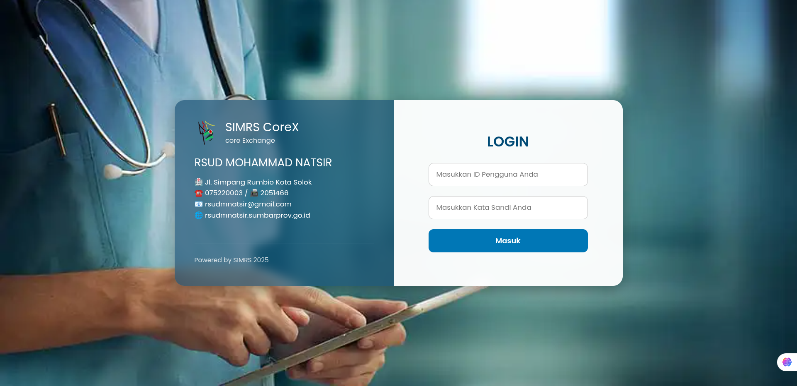
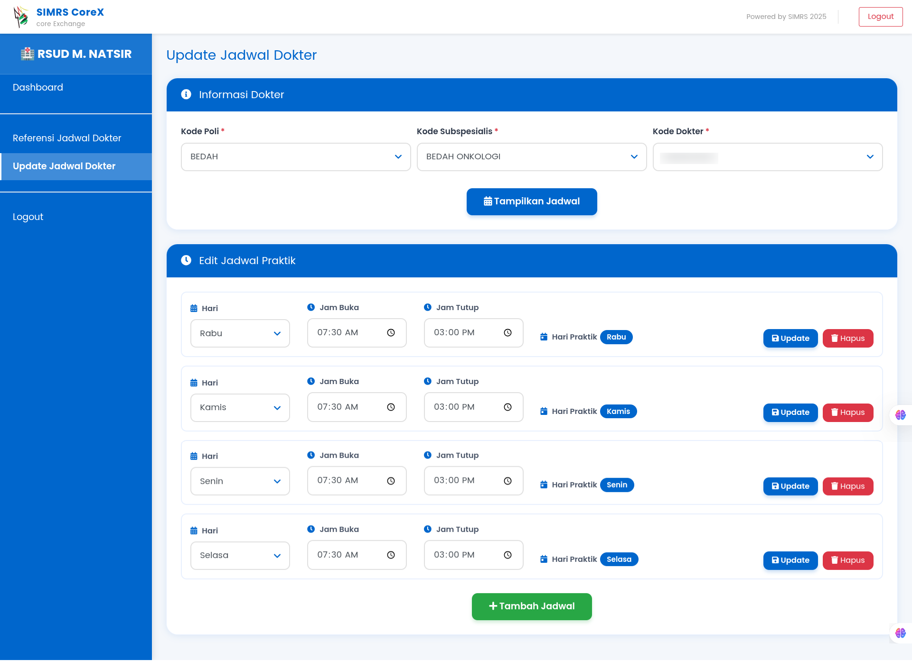

# SIMRS CoreX - Core Exchange Platform

Sistem Informasi Manajemen Rumah Sakit (SIMRS) CoreX adalah aplikasi web terintegrasi yang memudahkan pengelolaan jadwal dokter dan integrasi dengan API eksternal. Dibangun khusus untuk RSUD M. Natsir Solok dengan interface yang user-friendly dan responsif.

## 🎯 Fitur Utama

- **Manajemen Jadwal Dokter**: Tampilkan, referensi, dan update jadwal dokter secara real-time
- **Integrasi API**: Terhubung dengan sistem backend untuk sinkronisasi data
- **Signature & Authorization Otomatis**: Proses keamanan terpadu dalam setiap request
- **Local Storage**: Penyimpanan kredensial aman di browser user
- **Role-Based Access**: Sistem login dengan role admin dan superadmin
- **Responsive Design**: Kompatibel dengan desktop dan mobile devices
- **Dashboard Intuitif**: Interface yang mudah digunakan untuk semua kalangan

## 📋 Screenshots

### Login Page


### Dashboard


### Referensi Jadwal Dokter


### Update Jadwal Dokter


## 🛠️ Persyaratan Sistem

- **PHP** 7.4 atau lebih tinggi
- **Web Server** (Apache/Nginx)
- **Composer** untuk dependency management
- **Browser Modern** (Chrome, Firefox, Safari, Edge)
- **Node.js** (opsional, hanya untuk development tools)

## 📦 Instalasi

### 1. Clone Repository
```bash
git clone https://github.com/izanmaizan/simrs-corex.git
cd simrs-corex
```

### 2. Install Dependencies
```bash
composer install
```

### 3. Setup Konfigurasi
- Pastikan folder uploads memiliki permission 755
```

### 5. Akses Aplikasi
Buka browser dan akses:
```
http://localhost/simrs-corex
```

## 🔐 Keamanan

- **Enkripsi Data**: Semua data sensitif dienkripsi saat transit
- **Session Management**: Timeout session otomatis untuk keamanan
- **CORS Protection**: Proteksi cross-origin requests
- **Input Validation**: Validasi input di frontend dan backend
- **Access Control**: Role-based access untuk setiap fitur

## 👥 Pengguna Default

Aplikasi ini dilengkapi dengan user default untuk testing. Silakan ubah password setelah instalasi pertama kali.

## 📖 Dokumentasi

### Struktur Folder
```
simrs-corex/
├── js/
│   ├── main.js
│   └── json-viewer.js
├── css/
│   └── json-viewer.css
├── vendor/
│   └── (dependencies dari composer)
├── login.php
├── index.php
├── refjadwaldokter.php
├── updatejadwaldokter.php
├── setting.php
├── getResponse.php
├── logout.php
├── style.css
├── logo.webp
└── README.md
```

### File Utama

- **login.php** - Halaman login dengan autentikasi user
- **index.php** - Dashboard utama dengan overview sistem
- **refjadwaldokter.php** - Referensi jadwal dokter berdasarkan poli dan tanggal
- **updatejadwaldokter.php** - Update dan manajemen jadwal dokter
- **setting.php** - Setting kredensial API (khusus superadmin)
- **getResponse.php** - Backend untuk handle API requests

## 🚀 Penggunaan

### 1. Login
- Akses aplikasi di `/login.php`
- Gunakan kredensial yang telah didaftarkan
- Sistem akan redirect ke dashboard

### 2. Dashboard
- Lihat overview informasi rumah sakit
- Navigate ke fitur yang diinginkan melalui sidebar

### 3. Referensi Jadwal Dokter
- Pilih poli dan tanggal
- Sistem akan menampilkan jadwal dokter tersedia
- Lihat detail dokter, jam praktik, dan kapasitas

### 4. Update Jadwal Dokter
- Pilih poli, subspesialis, dan dokter
- Tampilkan jadwal untuk minggu tersebut
- Edit jadwal dengan form yang tersedia
- Konfirmasi dan submit perubahan

### 5. Setting Credentials (Superadmin Only)
- Kelola kredensial API di halaman setting
- Simpan kredensial ke local storage browser
- Hapus kredensial jika diperlukan
```

## 🐛 Troubleshooting

### Masalah: Session Timeout
**Solusi**: Session timeout diatur 8 jam. Login kembali jika session expired.

### Masalah: Favicon Tidak Muncul
**Solusi**: Hard refresh browser (Ctrl+Shift+R) atau clear browser cache.

### Masalah: API Error 401
**Solusi**: Verifikasi kredensial API di halaman setting. Pastikan ConsID dan Secret Key benar.

### Masalah: Responsive Design Tidak Bekerja
**Solusi**: Update browser ke versi terbaru. Bersihkan cache browser.

## 📝 Lisensi

Proyek ini dilisensikan di bawah [MIT License](LICENSE).

## 🤝 Kontribusi

Kontribusi sangat diterima! Berikut cara berkontribusi:

1. Fork repository ini
2. Buat branch fitur (`git checkout -b feature/AmazingFeature`)
3. Commit perubahan (`git commit -m 'Add some AmazingFeature'`)
4. Push ke branch (`git push origin feature/AmazingFeature`)
5. Buat Pull Request

## 📧 Support

Untuk pertanyaan atau laporan bug, silakan buat issue di repository ini atau hubungi:

- **Email**: support@rsudmnatsir.go.id
- **Phone**: +62-752-20003
- **Website**: rsudmnatsir.sumbarprov.go.id

## 🙏 Terima Kasih

Terima kasih kepada:
- RSUD M. Natsir Solok
- Tim Development
- Semua contributors

---
**Develop by Maizan Insani Akbar**
**Powered by SIMRS 2025** | RSUD M. Natsir Solok